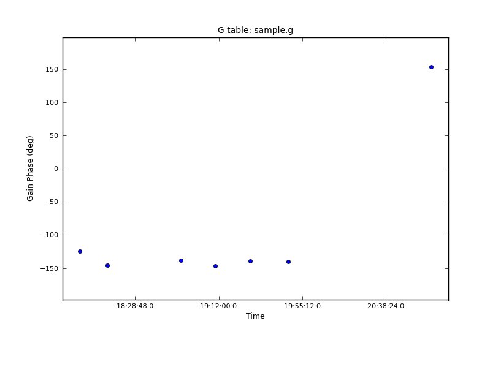
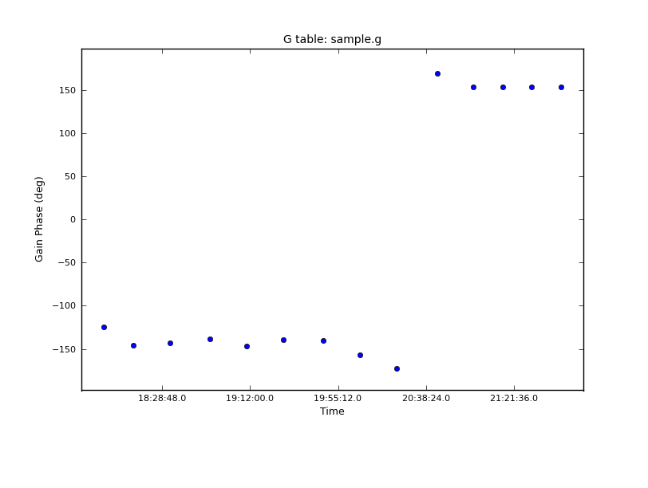

interpgain
=======

[CASA](http://casa.nrao.edu/) task to linearly interpolate and optionally extrapolate missing gain calibration solutions.

Lateset version: 1.0 ([download here](https://github.com/chrishales/interpgain/releases/latest))

Tested with: CASA Version 4.6.0

interpgain is released under a BSD 3-Clause Licence (open source, commercially useable); refer to the licence in this repository or the header of ```task_interpgain.py``` for details.

Feedback regarding interpgain is always welcome.

A before and after example is shown below for phase solutions on a single spectral window, feed, and antenna. Both interpolation and extrapolation was applied.
 

Installation
======

Download the latest version of the source files from [here](https://github.com/chrishales/interpgain/releases/latest).

Place the source files into a directory containing your measurement set. Without changing directories, open CASA and type
```
os.system('buildmytasks')
```
then exit CASA. A number of files should have been produced, including ```mytasks.py```. In a fresh terminal, return to your directory, reopen CASA, and type
```
execfile('mytasks.py')
```
To see the parameter listing, type
```
inp interpgain
```
For more details on how interpgain works, type
```
help interpgain
```
Now set some parameters and press go!

For a more permanent installation, place the source files into a dedicated interpgain code directory and perform the steps above. Then go to the hidden directory ```.casa``` which resides in your home directory and create a file called ```init.py```. In this file, put the line
```
execfile('/<path_to_interpgain_directory>/mytasks.py')
```
interpgain will now be available when you open a fresh terminal and start CASA within any directory.

Acknowledging use of interpgain
======

If you find interpgain useful, I'd appreciate an email and an acknowledgement in your paper. That or a lasagna.